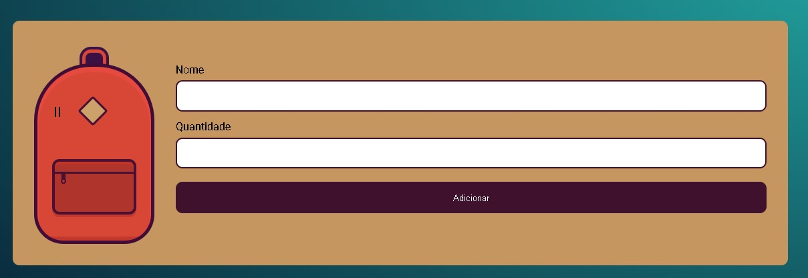

  

  

Este projeto tem como objetivo salvar itens dentro da mochila, e assim facilitar para o usuario quando ele for fazer as malas.

## Oque eu aprendi
<ul>
    <li>Interagir com o Local Storage: pegando itens, os removendo e limpando o Local Storage</li>
    <li>trabalhar ainda mais com arrays</li>
    <li>Criação de elementos usando o javascript</li>
    <li>Assim como colocando classes e conteudos</li>
</ul>

## Tecnologias utilizadas durante o curso
* Javascript: armazenando dados no navegador

## Tecnologias utilizadas no projeto
* HTML
* CSS